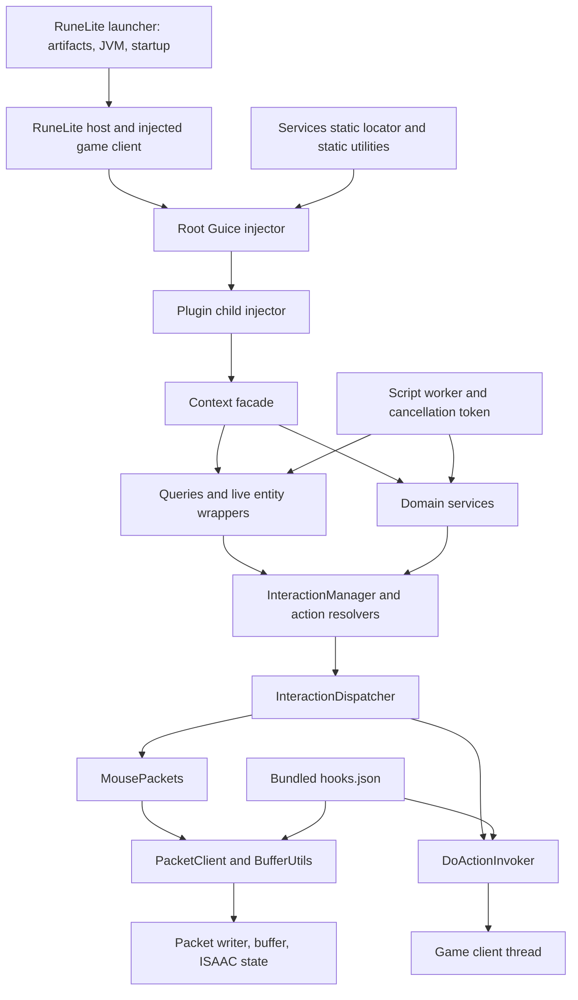

# Kraken API Architectural Review and Code Audit

**Reviewed:** 2026-09-09  
**Baseline:** `11682ae62f2dee9ed2482c457dd3609962c03a7a`  
**Scope:** Kraken API library, build/publication configuration, test architecture, and relevant RuneLite integration contracts. This is an audit, not an implementation patch.

## Executive Summary

**Kraken is a useful automation library with a reasonable public shape and unreliable operational contracts. I would not call it production-grade for unattended use yet.** The problem is not Java, reflection, Lombok, or the idea of wrapping RuneLite. The problem is that ownership, timing, failure, and lifecycle guarantees stop at individual methods instead of holding across complete operations.

The code has substantive strengths: reusable query bases, a small interaction dispatcher, domain-specific transport handlers, cached reflection metadata, cooperative cancellation, and meaningful tests for pure logic. This is worth improving. A wholesale rewrite would be wasteful.

However, several defects are release blockers:

- Bank PIN digits are written to INFO logs.
- Arbitrary chat-message text can become an authoritative shop price quote.
- Common interactions mutate packet/cipher state from the caller's worker thread.
- Packet validation occurs after a cipher-consuming node allocation; rejecting the packet can desynchronize subsequent packet opcodes.
- A timed-out client-thread action can execute later, after the caller has treated it as a failure.
- A stopped script's old worker can shut down its replacement executor after a restart.
- The prescribed `Context.shutdown()` lifecycle does not support RuneLite's reuse of disabled/re-enabled plugin instances, and the documented singleton scope is incorrect for Guice just-in-time bindings.

**The repeated architectural error is promising a stronger contract than the code implements.** A list of live wrappers is described as a thread-safe snapshot. A timeout is reported as an execution failure without cancelling execution. A plugin-scoped singleton is assumed where the root injector may own it. Spending limits can be exceeded by design. More comments will not fix these problems; narrower, enforceable contracts will.

### Evidence and limits

The inventory contains **254 main Java files and 41,711 lines**, including comments. `Context` has 94 direct imports from other main-source files; this measures dependency centrality, not runtime call frequency. Services account for 25,347 lines, queries 6,690, and core infrastructure 5,583. The largest files are `DpsCalculator` (2,119), `LocalPathfinder` (1,000), `ShopService` (994), and `GlobalPathfinder` (981).

Validation performed:

| Check | Result |
|---|---|
| Existing tests: `env GRADLE_USER_HOME=/tmp/gradle-home ./gradlew test --console=plain` | **515 tests, 58 suites, zero failures/errors/skips** |
| Shaded artifact build | `shadowJar` succeeded |
| Offline Java/Mockito probes against compiled Kraken classes | Reproduced timeout-after-failure execution, script restart teardown, Guice parent JIT scope, public-chat quote acceptance, stale spatial-query anchor, NPC health/icon errors, builder credential exposure, and mutable DPS cache exposure |
| Pinned injected-client bytecode | Inspected RuneLite `1.12.38` node factory, buffer opcode writer, and mapped method signatures using `javap` |
| Artifact inspection | 2,164,561-byte shaded JAR; 535 entries; includes annotated `shortestpath.ShortestPathPlugin` and UI classes |
| Runtime used for offline checks | Temurin OpenJDK 11.0.22, Linux environment |

The probes ran without starting a game client, connecting an account, or sending packets. No live exploitation, packet round-trip, frame-time benchmark, heap soak, or Windows/macOS/ARM run was performed. The review combines repository-wide inventory/search with detailed tracing of the central boundaries and selected services; it is not a claim that every combat formula or every transport was independently proven correct. Passing the existing suite does not invalidate the demonstrated defects: the suite does not cover these interleavings and trust boundaries.

Source references below identify the baseline file and line. Upstream `master` links describe the RuneLite sources inspected during this review; the local bytecode checks specifically used the pinned `1.12.38` artifacts.

## Architectural Critique

### Verified topology and state ownership



The graph shows dependencies, not an assertion that every edge marshals threads correctly. In particular, the packet edge currently does not.

| Boundary | State / authority | Feedback | Coupling and timing |
|---|---|---|---|
| RuneLite client | Live actors, widgets, scene, selected item/spell, packet writer and cipher | Events, client state, engine exceptions | Game-thread ownership is fundamental; separate successful reads do not make a multi-step operation atomic |
| `Context` | Facade, references, some resource registrations and teardown | Exceptions, fallbacks, logs | Almost every subsystem depends on it; constructor side effects and root lookups broaden its lifecycle responsibility |
| Queries | Mutable query declarations; returned wrappers retain live objects | Optional/list results; failures frequently become empty results | Source traversal is marshalled, but escaped wrappers, downstream callbacks and captured anchors have different semantics |
| Interactions | Resolved identifiers plus client-global selection state | Boolean engine-dispatch result | Resolution, source selection, target selection and mouse packet emission span multiple handoffs |
| Scripts/breaks | Worker executor, cancellation token, run flags, break state | Logs and callbacks | EDT, event-bus thread and workers share mutable lifecycle state without one transition owner |
| Pathfinding | Live capture, reusable configuration, search graph and cached reachability | `PathResult`, `WalkResult`, last route | Worker computation and client-thread preparation are coupled through locks and mutable objects |
| Shops | Server price/stock is authoritative; local quote and inventory observations are evidence | `ShopTransaction` and stop reasons | Chat origin, quote correlation, currency, and operation serialization must all be preserved |

### RuneLite integration: what the library can and cannot assume

The launcher controls bootstrap/artifact retrieval, verification, JVM settings and launch mode. Kraken does not acquire a stable game-client ABI merely by compiling against `net.runelite:client`. The reviewed launcher verifies bootstrap signatures and artifact hashes; those checks do not establish that Kraken's separately maintained hooks match a particular injected client. [RuneLite Launcher source](https://github.com/runelite/launcher/blob/master/src/main/java/net/runelite/launcher/Launcher.java)

The client loader obtains the initial class through its classloader and instantiates the injected client. Kraken's use of `client.getClass().getClassLoader()` for obfuscated types is appropriate. The deployment must still match host API, injected client, hooks, and Kraken artifact. [RuneLite ClientLoader source](https://github.com/runelite/runelite/blob/master/runelite-client/src/main/java/net/runelite/client/rs/ClientLoader.java)

RuneLite starts/stops plugins on the EDT and retains plugin objects across normal enable/disable transitions. Child injectors are created during plugin instantiation, not recreated on every enable. This matters directly to Kraken's shutdown design. [RuneLite PluginManager source](https://github.com/runelite/runelite/blob/master/runelite-client/src/main/java/net/runelite/client/plugins/PluginManager.java)

The reviewed Kraken main sources implement reflection-based invocation and manual buffer writes. They do not contain an active ASM/Javassist/Instrumentation transformation pipeline. Security-hook metadata alone does not prove that a runtime patch is installed. Reviewing an external Kraken launcher, injector, remote artifact verifier or native hook installer would require those components; their safety cannot be inferred from this library.

### Decisions worth preserving

1. **The service/query split is useful.** Dynamic selection belongs in queries; bank, camera and other system-level operations belong in services. `AbstractSpatialQuery` and `AbstractContainerQuery` reduce vocabulary drift.
2. **The facade itself is defensible.** `Context` is long partly because of documentation and accessors. Its size alone is not a reason to replace it. Its root-injector escape hatch and lifecycle side effects are the actual problems.
3. **Interaction dispatch is centralized enough to repair.** Resolver → resolved action → dispatcher → engine is a good seam for contract tests, world-view validation and one client-thread transaction.
4. **Caching reflection metadata is sensible.** `volatile`, locks and concurrent maps are used for several caches. Those caches should remain; their thread safety does not make the game state behind the handles thread-safe.
5. **Walker decomposition is substantially better than a monolithic movement script.** Transport shapes, requirement checks, arrival checks and typed outcomes are useful. `Walker.walkTo` rejects the client thread and exposes failure reasons.
6. **Tests are real engineering assets.** The query, transport, serialization and DPS tests protect significant pure logic. Preserve and extend them around the missing seams.
7. **Keeping host libraries out of the shaded JAR is correct.** Avoid duplicating RuneLite/Guice/Gson/Guava classes inside the host. Verify actual runtime versions and publication contents rather than trusting declarations alone.

### Structural liabilities

**DI and service location coexist without a coherent scope model.** `Context.getService()` resolves against RuneLite's root injector, even when the caller has a child-scoped `Context`. Static spell/prayer/UI helpers also reach the root. An injected override can therefore be bypassed by an entity method a few calls later. Providers defer construction cycles; they do not eliminate the dependency cycles or define ownership.

**Dispatch success is confused with observed completion.** A `boolean` cannot describe “no matching target,” “unsupported hook,” “queued,” “engine invoked,” “server rejected,” and “outcome unknown after timeout.” Existing richer walker/shop results show that a better pattern already exists in the codebase.

**Resource acquisition happens too early and release is fragmented.** Constructing a mouse registers a listener; constructing a context registers services and alters a host logger. Breaks and recording have separate lifecycles. Construction can partially succeed and then throw, leaving registrations behind. Disposal is distributed across library and plugin code, and restart is not consistently supported.

**Documentation is materially stale.** `CLAUDE.md` says CFR is the only shaded dependency; the build shades `shortest-path`. It describes test-source additions/exclusions absent from the current build. Both architecture guides describe simulation placement that does not match this checkout: `src/main/java/com/kraken/api/simulation` is absent and the produced JAR has no `colosim` entries. `PacketFactory` documents a remote fallback that it does not implement. These are navigation defects, not harmless wording differences.

### Performance, memory and platform assessment

| Area | Evidence-backed concern | Recommendation |
|---|---|---|
| Client-thread query cost | `first()`, `isPresent()`, `count()` and `take(n)` fully evaluate/materialize results. `GameObjectQuery.source()` first scans the entire current plane and builds wrappers. Sorting is performed before a terminal can discard all but one result. | Add short-circuit terminal execution where semantics permit; use a minimum scan for nearest. Benchmark before introducing persistent scene indexes. |
| Repeated scene access | Distance filters may make a separate player-location handoff during construction, followed by a full terminal handoff. Repeated wrapper getters can add more handoffs. | Capture query inputs once per evaluation; provide explicit immutable snapshots for bulk worker calculations. |
| Packet overhead | Every packet rebuilds a parameter-name index; numeric byte writes repeatedly use reflective array/offset access. | Compile validated packet write plans once; keep serialization state local and batch field access. Correctness comes before replacing reflection with method handles. |
| Pathfinding | Search allocates graph/frontier/visited structures and may run on a caller's client thread. Its cutoff resets whenever heuristic progress improves. | Separate capture/search, reject blocking calls on the game thread, use a hard elapsed-time/node budget and cancellation. |
| DPS | First use parses roughly 2.9 MB of equipment/monster JSON; the optimizer repeatedly invokes a large calculator. Object-graph heap use exceeds the serialized byte count. | Load immutable data off the client thread; benchmark realistic gear pools, reuse request-local data, and expose search budgets. Do not assume hill climbing guarantees a global optimum. |
| Thread count | A script executor, camera scheduler, local-player scheduler and optional break scheduler can exist across multiple scopes. | Define the owner and active lifetime of each resource. Daemon threads solve JVM exit blocking, not resource leaks. |
| Recording | A 500-gesture batch limit does not bound points in a single gesture or pending file writes. | Bound points/duration and queued bytes; use an owned writer with backpressure. |
| CPU differences | Main library logic is Java; no direct CPU-specific native implementation was found. More cores cannot accelerate serialized client-thread work, and racing game state is not a valid optimization. | Measure slow-core latency and allocation/GC, not just average throughput on a development CPU. |
| OS/JVM/display | AWT events are dispatched from arbitrary callers; replay paths hardcode `user.home/.runelite`; scaling and host JVM are deployment inputs. | Test EDT discipline, focus, HiDPI, canvas resizing, configurable data paths, and supported JDK/OS/architecture combinations. |

The ~2.16 MB shaded JAR is not itself a serious footprint problem. The risk is retained object graphs, duplicated scopes, unbounded recordings and frame-blocking work. There is no measured basis here for promising a particular FPS improvement or asserting a leak rate.

## Vulnerabilities & Bugs

Severity: **P1** means fix before claiming robust unattended operation; **P2** means a significant correctness, reliability or maintainability issue. “Reproduced” means an isolated executable probe. “Source/bytecode confirmed” means the faulty operation or ordering was traced directly; it does not imply a live-client incident was observed.

### F06 — P1: Context scope and teardown do not match plugin lifecycle

**Evidence:** [Context.java:89](src/main/java/com/kraken/api/Context.java#L89), [Context.java:136](src/main/java/com/kraken/api/Context.java#L136), [Context.java:355](src/main/java/com/kraken/api/Context.java#L355), [KrakenModule.java:26](src/main/java/com/kraken/api/KrakenModule.java#L26), [Services.java:23](src/main/java/com/kraken/api/core/Services.java#L23).

Three connected problems exist:

1. The module/context documentation asserts per-plugin singletons even without explicit bindings. Guice can place a just-in-time singleton in an ancestor when its dependencies are satisfiable there. An offline test using the resolved Guice runtime demonstrated two child injectors receiving the same unbound singleton. The exact Kraken placement depends on installed bindings; the unconditional documentation claim is false.
2. `Context.shutdown()` permanently unregisters services/listeners and shuts down final camera/local-player schedulers. It has no matching start/reactivation operation. Normal RuneLite disable→enable reuses injected objects, so following the documented shutdown guidance leaves resources dead on re-enable. If the context is shared, one plugin's shutdown can disrupt another.
3. `getService()` and static utilities escape to the root injector. Even with explicit child bindings, they do not reliably return the services owned by the caller's context.

Constructor registrations occur before all constructor work succeeds. Hooks or later initialization failures can strand registrations. `shutdown` is a volatile check-then-set rather than an atomic transition, and shutting down can instantiate an otherwise unused camera service through its provider.

**Fix:** Choose and test a scope contract. Use an explicitly client-owned runtime for shared game resources and a per-plugin session for cancellable work, or use explicitly isolated plugin resources with a coherent shared command gateway. Resolve services from the owning scope. Separate reversible start/stop from final disposal. Make startup transactional and teardown idempotent. Test two plugins, mixed enable order, startup failure and repeated disable/enable.

### F07 — P1: A stopped script can kill its replacement run

**Evidence:** [Script.java:108](src/main/java/com/kraken/api/core/script/Script.java#L108), [Script.java:253](src/main/java/com/kraken/api/core/script/Script.java#L253), [Script.java:294](src/main/java/com/kraken/api/core/script/Script.java#L294), [Script.java:328](src/main/java/com/kraken/api/core/script/Script.java#L328).

Reproduced sequence: hold the current `loop()` on a latch; call `stop()`; call `start()` before that loop exits; release the old loop. The restart installs a fresh executor. The old executor's queued `finishStop()` then calls `executor.shutdown()` through the mutable field, shutting down the **new** executor. A subsequent tick can encounter rejected submission.

Other lifecycle holes share the cause: `future` is not consistently synchronized across callers; `start()` resets it before publishing a new run; `resume()` can mark a never-started/stopped script running without registration; `onStart()` failure leaves the script marked running and registered. `pause()` does not quiesce an in-flight loop. The ordinary post-loop `Thread.sleep(delay)` is not woken by token cancellation, so stop completion can wait the full delay.

**Fix:** Introduce a run object owning its executor, token, future and generation. Serialize transitions through a small state machine (`STOPPED`, `STARTING`, `RUNNING`, `PAUSED`, `STOPPING`). Old callbacks may only finalize their own run. Expose stop completion and define whether pause permits in-flight actions. Test stop/start, startup exceptions, resume-after-stop and cancellation during delay.

### F08 — P1: Item/spell selection and target dispatch are not one transaction

**Evidence:** [InteractionManager.java:286](src/main/java/com/kraken/api/core/interaction/InteractionManager.java#L286), lines 320–457; [PrayerService.java:217](src/main/java/com/kraken/api/service/prayer/PrayerService.java#L217).

Widget→target interactions dispatch source selection, return across the client-thread handoff, then resolve/dispatch the destination. Selected item/spell state is client-global. A human action or another script can change selection between those halves, causing the second action to use a different source or lose its target mode. Similar multi-handoff sequencing undermines the “same tick” intent of prayer flicking from a worker.

**Fix:** Revalidate source and target identities and perform selection plus destination dispatch inside one client-thread command. Keep off-thread planning outside that command. Invalidate commands on scene/session changes. Test an injected competing selection and tick boundaries; validate engine invocation separately from observed server outcome.

### F09 — P2: Queries return live views and reusable spatial queries freeze the old player position

**Evidence:** [AbstractQuery.java:17](src/main/java/com/kraken/api/core/AbstractQuery.java#L17), lines 65–96, 217–229 and 380–381; [AbstractEntity.java:12](src/main/java/com/kraken/api/core/AbstractEntity.java#L12); [AbstractSpatialQuery.java:68](src/main/java/com/kraken/api/core/AbstractSpatialQuery.java#L68), lines 130–143; [NpcEntity.java:19](src/main/java/com/kraken/api/query/npc/NpcEntity.java#L19).

Materialization snapshots membership, not entity state. Wrappers retain live actors/widgets. `NpcEntity.getWorldLocation()` and health/icon methods read directly, and `firstMatching(predicate)` invokes the extra predicate after evaluation has returned. Thus `query.stream().map(NpcEntity::getWorldLocation)` and `firstMatching(n -> n.raw().isDead())` can touch live state on a worker despite the base-class threading claim.

Separately, `within(distance)` captures `localPlayerLocation()` when the filter is added; `sortByDistance()` captures its anchor similarly. A reused query keeps that old origin. The probe moved the player onto the target and re-evaluated an existing `within(1)` query; it still returned empty. This contradicts the practical expectation of fresh player-relative queries.

**Fix:** Distinguish `EntityView` from immutable snapshots, or consistently marshal view getters. Run predicates according to a documented terminal contract. Resolve dynamic player anchors once per evaluation; retain explicit fixed-anchor overloads. Document mutable query builders as thread-confined or make their declarations immutable. Test movement between repeated evaluations and thread identity inside downstream predicates.

### F10 — P2: Camera and break workers bypass state ownership

**Evidence:** [CameraService.java:363](src/main/java/com/kraken/api/service/camera/CameraService.java#L363), lines 406–417; [BreakManager.java:45](src/main/java/com/kraken/api/core/script/breakhandler/BreakManager.java#L45), lines 248–309; [BreakState.java:9](src/main/java/com/kraken/api/core/script/breakhandler/BreakState.java#L9).

The camera scheduler enumerates live NPCs and writes `setCameraYawTarget()` directly from its worker. An exception terminates the fixed-rate task, but `isTrackingNpc()` checks only non-null and `trackNpc()` checks cancellation rather than completion, so a dead task can still be reported as active and block restarting.

Break state is read/written by scheduled workers, event handlers and public lifecycle calls using ordinary mutable fields. The “already resumed” guard is not atomic. Shutdown cancellation does not establish exclusive ownership against an already-running end-of-break callback.

**Fix:** Make scheduled callbacks enqueue short game-thread state transitions. Keep break transitions under one owner and tag callbacks with a generation. Detect completed exceptional camera tasks and report their failure. Test scheduler exceptions, shutdown concurrent with break end, and duplicate resume triggers.

### F11 — P2: Pathfinding can block the client while holding a lock and has no hard search deadline

**Evidence:** [GlobalPathfinder.java:250](src/main/java/com/kraken/api/service/pathfinding/GlobalPathfinder.java#L250), lines 281–307 and 311–433.

`findPathResult()` holds `synchronized(this)` while waiting for `ctx.runOnClientThread(prepare)`. If the game thread calls the same method while a worker owns the monitor, it blocks on the monitor and cannot service the worker's queued preparation. The context timeout eventually breaks the wait, so this is normally a multi-second client stall rather than a permanent deadlock. The queued preparation remains runnable because of F05.

The method also permits the entire search to execute on the client thread. Its cutoff is a no-improvement budget: line 386 resets it whenever a better heuristic is found. It is not a hard total-duration bound, and the loop does not check script cancellation/interruption. `prepare()` mutates a reusable configuration rather than producing an immutable search input.

**Fix:** Capture an immutable request on the game thread before acquiring a worker-only search lock, or serialize search requests in an owned executor. Reject blocking searches on the game thread. Add a monotonic total deadline, node/memory budget and cancellation checks, while retaining any useful no-progress cutoff as a separate setting. Test the monitor/queue interleaving with a controllable executor.

### F12 — P2: Shop maximum-price/spend contracts are soft, including with one-item steps

**Evidence:** [ShopService.java:576](src/main/java/com/kraken/api/service/shop/ShopService.java#L576), lines 786–890; [BuyOrder.java:38](src/main/java/com/kraken/api/service/shop/BuyOrder.java#L38); [ShopOrder.java:45](src/main/java/com/kraken/api/service/shop/ShopOrder.java#L45).

When price is unknown, `affordableQuantity()` allows one item even with a configured price/spend limit. When a quote fails after a previous successful step, the old price remains usable. With revaluation disabled, the prior step's average price estimates the next step. A rising price can exceed the remaining spend budget even with `step(1)`.

Some overshoot is explicitly documented; that makes this partly a product-contract defect, not an undisclosed implementation accident. But claims that `step(1)` removes budget overshoot or that either `step(1)` or revaluation enforces an exact price are stronger than the implementation. Quotes are also not binding server reservations: another player can change stock before purchase. Currency is parsed but not included in the quote match or affordability unit model.

**Fix:** Define hard versus best-effort limits explicitly. Hard-limit mode must stop on unknown/stale/incompatible-currency quotes and avoid speculative purchases. If server semantics make a strict guarantee impossible, expose that limitation in the API rather than naming an estimate `maxSpend` without qualification. Serialize order ownership, and observe inventory/item/coin changes coherently. Test unknown price, failed revaluation, price increases, token shops and concurrent orders.

### F13 — P2: Spatial geometry and world-view assumptions are inconsistent

**Evidence:** [TileService.java:146](src/main/java/com/kraken/api/service/tile/TileService.java#L146), lines 204–227 and 413–446; [NpcMenuActionResolver.java:39](src/main/java/com/kraken/api/core/interaction/resolver/NpcMenuActionResolver.java#L39); [TileObjectMenuActionResolver.java:37](src/main/java/com/kraken/api/core/interaction/resolver/TileObjectMenuActionResolver.java#L37).

`isObjectReachable()` reconstructs a footprint from the center and composition, testing `getOrientation() == 1 || == 3`. That confuses angular orientation with the two-bit placement rotation. RuneLite already exposes scene min/max bounds, sizes and placement config. Center reconstruction also shifts even-sized footprints: for a two-tile object the integer `(sizeX - 1) / 2` adjustment is zero. [RuneLite GameObject contract](https://github.com/runelite/runelite/blob/master/runelite-api/src/main/java/net/runelite/api/GameObject.java)

Its surrounding-tile test is optimistic adjacency, not proof of a legal interaction across walls/access sides. The reachability cache is keyed only by tick, omitting scene/base, plane, world view, player origin and collision invalidation. Instance conversion duplicates RuneLite helpers; `fromWorldInstance()` reconstructs the target on each template plane without checking the requested point's plane.

Resolvers use the top-level world-view ID even when their public API receives an actor/object belonging to another view. The pinned RuneLite API exposes `getWorldView()` on both actor and tile-object interfaces. A non-top-level entity can therefore be addressed in the wrong view; top-level-only support should at least reject it explicitly.

**Fix:** Use live scene bounds, existing coordinate conversions and the entity's owning world view. Centralize scene identity and collision cache invalidation. Distinguish walkable tile, adjacent tile and interactable object. Test rotated 2×3 objects, even dimensions, walls/corners, overlapping template planes, repeated instance chunks and secondary world views.

### F14 — P2: Hook resolution is permissive and lacks a compatibility gate

**Evidence:** [DoActionInvoker.java:136](src/main/java/com/kraken/api/core/interaction/DoActionInvoker.java#L136), [PacketClient.java:394](src/main/java/com/kraken/api/core/packet/PacketClient.java#L394), [ReflectionService.java:117](src/main/java/com/kraken/api/service/util/ReflectionService.java#L117), [HooksLoader.java:45](src/main/java/com/kraken/api/core/hooks/HooksLoader.java#L45), [hooks.json](src/main/resources/hooks.json).

`DoActionInvoker` chooses the first case-insensitive name match despite a comment promising signature selection. The packet factory selects only by return type and ignores the configured factory-method name. `ReflectionService` keys methods by name and argument count, so same-arity overloads alias. Reflection enumeration order is not a sound disambiguation contract.

The hooks resource has no client build/revision fingerprint or comprehensive semantic validation. The loader checks major groups, then exposes mutable maps/model structures. Compiling against RuneLite does not validate obfuscated handles. The current `doAction`, factory and add-node signatures resolved against pinned `1.12.38`; this finding is not a claim that those names are currently missing.

Dummy arguments are also not universally unused: the inspected node factory bytecode contains branches testing its byte parameter. `DoActionInvoker` documentation says only the type matters and the value is never read. That is an unsafe general rule for obfuscated client methods.

**Fix:** Publish immutable, versioned hook manifests with exact case-sensitive JVM descriptors, static/instance expectations, packet lengths and verified dummy values. Resolve and validate a capability set before enabling actions. Keep passive queries usable when an interaction capability is unavailable. Do not automatically replace verified dummy values with zero or infer ABI from a single matching name.

### F15 — P2: NPC health and head-icon methods produce wrong results or throw

**Evidence:** [NpcEntity.java:40](src/main/java/com/kraken/api/query/npc/NpcEntity.java#L40), lines 64–71.

Both health ratio and scale may be `-1` when unknown. The code guards only zero scale, so `-1 / -1` becomes **100% health**; reproduced. The documented result for unknown health is `-1`. [RuneLite Actor contract](https://github.com/runelite/runelite/blob/master/runelite-api/src/main/java/net/runelite/api/Actor.java)

`getHeadIcon()` treats a sprite index as an unchecked `HeadIcon.values()` ordinal. Sprite indexes are meaningful with their archive IDs, not universally as enum ordinals. An out-of-range index throws; the probe reproduced this with a synthetic short value. An unrelated archive can also map to an incorrect prayer icon. [RuneLite NPC contract](https://github.com/runelite/runelite/blob/master/runelite-api/src/main/java/net/runelite/api/NPC.java)

**Fix:** Read health consistently on the client thread; return unknown for negative ratio/nonpositive scale. Resolve supported archive/index pairs explicitly and represent unknown icons without throwing. Test unknown health, absent/multiple icons and unsupported sprite archives.

### F16 — P2: Input dispatch and recording have unowned concurrency and persistence

**Evidence:** [VirtualMouse.java:42](src/main/java/com/kraken/api/input/mouse/VirtualMouse.java#L42), lines 195–217 and 454–470; [KeyboardService.java:26](src/main/java/com/kraken/api/input/KeyboardService.java#L26), lines 74–83; [InstantStrategy.java:23](src/main/java/com/kraken/api/input/mouse/strategy/instant/InstantStrategy.java#L23); [MouseRecorder.java:89](src/main/java/com/kraken/api/input/mouse/MouseRecorder.java#L89), lines 161–175 and 217–244.

Mouse/keyboard helpers call AWT `dispatchEvent()` on whichever thread invokes them and change focusability outside a consistent EDT boundary. `lastPoint` and static strategy configuration are mutable across callers/listeners. Setting a future event timestamp does not delay dispatch. The wind-config movement overload does not update `lastPoint` as the main overload does.

Recorder batch writes use the common pool, read mutable `currentLabel` when they eventually run, and append through independently opened writers. A stop/start under another label can write an old batch into the new file; stop does not join pending writes. A synchronized gesture list does not serialize file output. A gesture can grow without bound until a click. Labels replace spaces only, so `../` can escape the intended data directory when writing; no remote source for that label was established.

**Fix:** Give input one serialized owner and marshal AWT event emission to the EDT without sleeping there. Keep delays and cancellation in a worker/scheduler. Give recording a dedicated bounded writer queue with immutable `(path, batch)` jobs and drain completion. Validate/normalize filenames against the data directory and cap gesture size. Test rapid label changes, stop during flush, cancellation and focus loss.

### F17 — P2: Failure propagation is inconsistent enough to mislead automation

**Evidence:** [Context.java:316](src/main/java/com/kraken/api/Context.java#L316), [AbstractQuery.java:91](src/main/java/com/kraken/api/core/AbstractQuery.java#L91), [PrayerService.java:87](src/main/java/com/kraken/api/service/prayer/PrayerService.java#L87), [GrandExchangeService.java:121](src/main/java/com/kraken/api/service/grandexchange/GrandExchangeService.java#L121), [LoginService.java:47](src/main/java/com/kraken/api/service/ui/login/LoginService.java#L47), lines 160–165.

The callable client-thread overload waits and wraps failures; the runnable overload is asynchronous off-thread and throws directly when already on-thread. A change from a value-returning lambda to a void lambda changes ordering and feedback semantics.

Queries catch any wrapped execution exception—including predicate bugs—and return empty results while logging only a generic message. `PrayerService.toggle()` discards dispatch failure and returns true. GE order methods return a slot before queued work executes, including when a sell item later proves absent; separate requests can select the same unreserved free slot. `LoginService` expects `setLoginIndex()` to throw, but `ReflectionService.invoke()` logs and returns null, so login can be triggered after that step failed.

**Fix:** Name synchronous and asynchronous APIs distinctly; provide completion handles for queued commands. Use structured dispatch outcomes and preserve causes. Make fallback behavior opt-in for queries. Check interaction results, reserve/validate GE operations, and propagate reflective invocation success separately from the invoked method's return value. Tests should assert that failures cannot masquerade as absence, successful toggles or queued orders.

### F18 — P2: Host diagnostics are globally suppressed

**Evidence:** [Context.java:109](src/main/java/com/kraken/api/Context.java#L109).

Context construction reflectively obtains the client's logger and sets its level to ERROR. This changes the logger instance's behavior, not just one noisy menu-action message. The previous level is not retained/restored. Multiple contexts can repeat the mutation. The code most dependent on unstable client internals deliberately removes part of the diagnostic channel needed to investigate them.

**Fix:** Remove this side effect from `Context`. If a particular message needs filtering, make narrowly scoped, explicitly configured filtering the responsibility of the host integration layer. Preserve warnings and compatibility errors. Record action type, capability/revision and failure cause without secrets.

### F19 — P2: DPS data is safely published but remains externally mutable

**Evidence:** [DpsDataStore.java:46](src/main/java/com/kraken/api/service/util/dps/data/DpsDataStore.java#L46), lines 122–130 and 166–182; [EquipmentItem.java:10](src/main/java/com/kraken/api/service/util/dps/model/EquipmentItem.java#L10).

The volatile/synchronized lazy-load pattern safely publishes successful initialization; it is not itself a missing-volatile bug. The problem is that `equipment()` returns the cached mutable `@Data` object, and spell lookups expose mutable values even through an unmodifiable map. A probe changed a returned bronze dagger's name and observed the altered value on the next lookup. Consumers can similarly corrupt combat stats for other callers and race calculations. Monster lookups already return copies, showing a safer precedent.

**Fix:** Store deeply immutable equipment/spell definitions or return defensive copies. Keep per-calculation modifications in a separate request/loadout. Add mutation-isolation tests and version/provenance metadata for the bundled data. Benchmark cold load and optimizer cost separately from formula correctness.

### F20 — P2: The published library includes an unrelated discoverable plugin

**Evidence:** [build.gradle:49](build.gradle#L49), lines 94–104; inspected `build/libs/kraken-api-1.0.0.jar`.

Shading `shortest-path` imports its entire runtime artifact, including `shortestpath.ShortestPathPlugin`, overlays and debug UI. Bytecode inspection confirms the `@PluginDescriptor(name="Shortest Path")` annotation. RuneLite's sideload path scans classes in a supplied JAR for plugins, so deployment through that path can discover this bundled plugin in addition to the intended consumer. Shared-classpath deployments also risk collisions with another copy of unrelocated `shortestpath` classes/resources. Classloader isolation affects that risk; a collision was not observed in a live installation.

**Fix:** Depend on an engine/data artifact without plugin UI, or extract that boundary in the maintained dependency. Verify resource loading before relocation. Add an artifact-content test rejecting unintended `Plugin` subclasses and host classes, plus a consumer smoke test using the published JAR rather than loose test classes.

### F21 — P2: Item-price caching has no freshness or stable callback-thread contract

**Evidence:** [ItemPriceService.java:29](src/main/java/com/kraken/api/service/util/price/ItemPriceService.java#L29), lines 50–56, 133–169 and 180–234.

Cached prices never expire; callers must separately remember to refresh them. Concurrent misses for the same item create separate requests. A cache hit invokes the callback inline on the caller's thread, while a miss completes from OkHttp's callback thread. “Nonblocking” does not make consumer client-state access safe. Outstanding callbacks have no plugin-session cancellation owner. The synchronous method is correctly documented as blocking; the missing invariant is a consistent freshness/execution model across both forms.

**Fix:** Define TTL/staleness, deduplicate in-flight requests, bound outstanding work, expose cancellable futures or document/use a chosen completion executor. Preserve timestamps and avoid treating missing/null trade values as meaningful zero-price evidence. Test hit/miss thread behavior, concurrent misses, refresh failure and out-of-order completions.

### F22 — P2: Release publication can expose inconsistent artifacts and tags

**Evidence:** [.github/workflows/release.yml](.github/workflows/release.yml), version calculation, package cleanup, tag/release creation, MinIO uploads and final Maven publication; [build.gradle:9](build.gradle#L9).

The workflow calculates a patch from remote/local tags without workflow concurrency control. Two releases can select the same version. It deletes old package versions before the new publication succeeds, creates the tag/release before uploading all distribution artifacts, and updates a mutable top-level `hooks.json` separately from versioned JARs. A later failure can leave a visible release with incomplete distribution; concurrent uploads can pair mutable hooks with the wrong release for external consumers that fetch them independently.

The library itself reads bundled hooks, so this does **not** prove that current library execution fetches the mutable remote file. The concern is the published integration contract. Local builds also default to `1.0.0`, independently of `version.txt`, making distinct development artifacts easy to confuse. No dependency lock or verification metadata was found; `mavenLocal()` adds another environment-dependent resolution input.

**Fix:** Serialize release version allocation, publish immutable versioned artifact/hook pairs with hashes, and expose a release manifest only after all uploads verify. Tag/finalize after successful publication; perform retention cleanup afterward. Pin and verify build inputs, define an intentional local version, and test failure recovery at each publication stage.

## Actionable Roadmap

### 1. Contain the immediate security and protocol failures

Remove PIN logging; redact builder representations. Filter shop-message origin before parsing. Put a client-thread guard at the packet gateway and migrate every call path through it. Validate all packet payload/ABI requirements before cipher consumption. Disable failed interaction capabilities explicitly instead of repeatedly attempting incompatible operations.

**Acceptance:** Synthetic secrets never enter logs; public/private chat cannot supply a quote; invalid payloads consume no cipher output; no worker touches the writer/cipher; a late or incompatible action has an explicit outcome.

### 2. Define runtime and plugin-session ownership

Replace the implicit scope story with explicit bindings and a lifecycle contract. A small client-owned runtime plus per-plugin sessions is a good fit: runtime owns shared transport/state access; sessions own scripts, pending requests, subscriptions and cancellation. Keep `Context` as the consumer facade. Remove root service-location calls from instance methods in stages, using constructor/provider injection from the owning scope.

**Acceptance:** Two plugins coexist; stopping one does not stop another; repeated enable/disable does not lose functionality or accumulate listeners/threads; partial startup rolls back registrations.

### 3. Repair command completion and script transitions

Separate `callOnClientThread`, `submitOnClientThread` and strict thread assertions. Add command deadlines and session/run generations. Refactor `Script` around a run-owned state object and serialized transitions. Use cancellation-aware delays and return a stop-completion handle.

**Acceptance:** The F05/F07 latch-based repros fail to reproduce the bugs. Cancelled pending commands do not execute; already-started commands report uncertainty accurately; old callbacks cannot mutate a new run; startup failure returns to a stopped state.

### 4. Make whole interactions atomic at the client boundary

Use one short game-thread transaction for target validation, source selection, mouse packet handling and engine dispatch. Resolve view/scene identity from the target. Keep server observation as a later explicit phase. Apply the same design to prayer sequences and GE setup/confirmation, with single-operation ownership for shared UI state.

**Acceptance:** Competing item/spell selections cannot cross; stale/despawned targets are rejected; secondary world views are handled or explicitly unsupported; returned outcomes distinguish dispatch from observed completion.

### 5. Tighten query and spatial contracts

Keep the fluent API, but distinguish live views from immutable snapshots. Resolve player-relative anchors at evaluation time. Provide strict failure behavior and thread-confined/immutable query declarations. Replace footprint reconstruction with RuneLite scene bounds and unify instance/world-view conversion. Give reachability caches complete invalidation rules.

**Acceptance:** Repeated queries follow a moving player; no documented worker-safe accessor touches unowned live state; scene/plane changes invalidate results; geometry tests cover rotation, even sizes, walls and instances.

### 6. Repair stateful service protocols

Serialize shop valuations/orders and bind quotes to validated origin, item, direction, currency and session. Define hard versus estimated limits. Move camera/break transitions to one thread, propagate login/GE/prayer failures, isolate mutable DPS requests from static definitions, and give price callbacks an explicit executor/freshness policy.

**Acceptance:** Unknown prices never authorize a hard-limit purchase; stale responses cannot complete a new request; dead periodic tasks are observable/restartable; lookup consumers cannot mutate another caller's combat data.

### 7. Optimize with measurements after the contracts hold

Benchmark complete query evaluation, reachability, packet planning and representative optimizer/search workloads. Record p50/p95/p99 game-thread duration, allocations per query/action, queue delay, pending work, cancellation latency and cold-data-load cost. Use JFR/heap analysis for repeated enable/disable and long recording sessions. Prefer terminal short-circuiting and precompiled packet plans before introducing indexes or custom bytecode.

**Acceptance:** A written frame-time budget is met on the slowest supported machine; searches obey hard budgets; thread/listener counts stabilize across lifecycle cycles; recording memory/queue size remains bounded. Set numerical thresholds from baseline measurements, not guesses.

### 8. Make packaging, compatibility and documentation verifiable

Extract the pathfinding engine dependency from its plugin UI. Publish exact host/injected-client/hook compatibility metadata and immutable release manifests. Test the actual shaded JAR through supported loading paths. Split pure unit tests from in-client harness sources so live-plugin compilation is not the only integration check. Update `CLAUDE.md`, `AGENTS.md` and examples to match the real build and lifecycle.

**Acceptance:** Published artifacts contain only intended classes/resources; offline ABI validation and packet golden tests pass; a consumer plugin can load, disable and re-enable from the published JAR; release failure cannot advertise an incomplete artifact set.

### Verification fixtures to retain when implementing fixes

The isolated review probes live in `/tmp/kraken-audit/AuditProbe.java` and their output in `/tmp/kraken-audit/probe-output.txt` for this workspace session. They are audit experiments, not committed regression coverage. Convert the scenarios into repository tests with controllable executors and synthetic data during implementation.

The central reproductions are deterministic:

```text
Timeout: queue callable → withhold execution → observe timeout → run queued callback
         Current behavior: side effect executes after reported failure.

Restart: start loop → hold loop on latch → stop → start → release old loop
         Current behavior: old finishStop shuts down the new executor.

Quote:   deliver PUBLICCHAT with a syntactically valid valuation message
         Current behavior: ShopService.lastQuote accepts it.

Spatial: construct within(1) → move player onto previously distant NPC → evaluate again
         Current behavior: query still uses original player position.

Health:  NPC ratio = -1, scale = -1
         Current behavior: getHealthPercentage() returns 100.0.
```

No library source, hooks, tests or release configuration was changed by this review. The recommended fixes remain implementation work; the passing baseline test suite is not a production-readiness certification.
