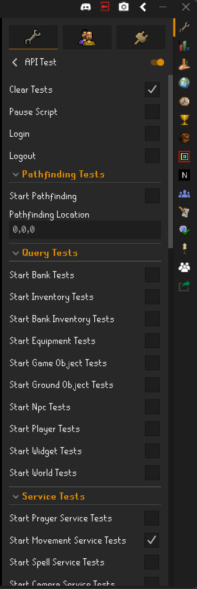
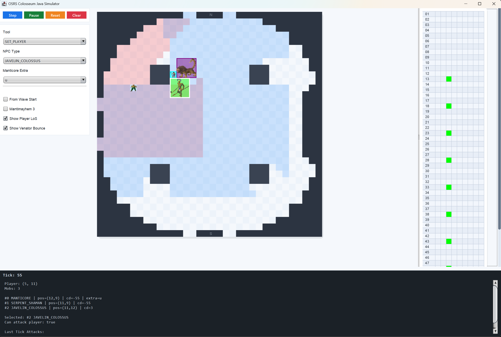

<!-- PROJECT LOGO -->
<br />
<div align="center">
  <a href="https://kraken-plugins.com">
    
  </a>

<h3 align="center">Kraken API</h3>

  <p align="center">
   An extended RuneLite API for creating plugins that support client interactions.
    <br />
</div>

[](https://github.com/cbartram/kraken-api/actions/workflows/release.yml)
[![Contributors][contributors-shield]][contributors-url]
[![Forks][forks-shield]][forks-url]
[![Stargazers][stars-shield]][stars-url]
[![Issues][issues-shield]][issues-url]

---

# Getting Started

Kraken API is designed to extend the RuneLite API with additional client interaction utilities for writing automation-based plugins that are fully compatible with RuneLite.
This API uses network packets to perform "click" interactions within the game client and is based on mappings defined by the [EthanVann API](https://github.com/Septharoth/EthanVannPlugins/tree/master). It's also worth shouting
out the [Vitalite](https://github.com/Tonic-Box/VitaLite/) client and project as their open source expertise of the game client helped make some of the Kraken API possible!

Specifically credit to Vitalite's Dialogue, G.E., and World Map API's and inspiration on Kraken's `TaskChain` and `ReplayStrategy` for mouse movement!

## API Usage

The following RuneLite "plugin" is purely for an example of the API's capabilities and isn't a full-fledged automation script.

```java
@PluginDescriptor(
        name = "Example",
        description = "Example plugin"
)
public class ExamplePlugin extends Plugin {
    
    @Inject
    private Context ctx;
    
    @Inject
    private BankService bank;
    
    @Inject
    private MovementService movement;
    
    @Inject
    private PrayerService prayer;
    
    @Subscribe
    private void onGameTick(GameTick e) {
      Player local = ctx.players().local().raw();
      
      if(local.isInteracting()) {
          return;
      }
      
      if(!bank.isOpen()) {
          // Open a bank
          ctx.gameObjects().withName("Bank booth").nearest().interact("Open");
      } else {
          // Withdraw a Rune Scimitar
          ctx.bank().nameContains("Rune scimitar").first().withdraw();
      }
      
      // Wield a Rune Scimitar
      ctx.equipment().withId(1333).first().wield();
      
      // Move to a new position
      movement.moveTo(new WorldPoint(1234, 5678));
      
      // Activate a protection prayer
      prayer.activatePrayer(Prayer.PROTECT_FROM_MELEE);
      
      // "Click" on a Goblin and attack it.
      ctx.npcs().withName("Goblin")
            .except(n -> n.raw().isInteracting())
            .nearest()
            .interact("Attack");
      
      
      // Take the goblin bones
      ctx.groundItems().reachable()
              .within(5)
              .filter(item -> item.name().equalIgnoreCase("bones"))
              .first()
              .take();
      
      // Bury the bones
      ctx.inventory().withName("Bones").first().interact("Bury");
    }
}
```

To use the API in an actual RuneLite plugin, you should check out the [Kraken Example Plugin](https://github.com/cbartram/kraken-example-plugin)
which shows the best practice usage of the API within an actual plugin.
To set up your development environment, we recommend following [this guide on RuneLite's Wiki](https://github.com/runelite/runelite/wiki/Building-with-IntelliJ-IDEA).

Once you have the example plugin cloned and setup within Intellij, you can run the main class in `src/test/java/PluginRunnerTest.java plugins.api.ApiTestPlugin` to run RuneLite with
the example plugin loaded in the plugin panel within RuneLite's sidebar. See a recommended [Gradle example](#gradle-example-recommended) for more information on
integrating the API into your plugins and build process.



> If you are just looking to use pre-existing plugins, you can skip this repository and head over to our website: [kraken-plugins.com](https://kraken-plugins.com). 
> For more documentation on the API and Kraken plugins, please see our [official documentation here](https://kraken-plugins.com/docs/).

### Prerequisites
- [Java 11+](https://adoptium.net/) (JDK required)
- [Gradle](https://gradle.org/) (wrapper included, no need to install globally)
- [Git](https://git-scm.com/)
- [RuneLite](https://runelite.net) (for testing and running plugins)

### Building

You can build the project with Gradle:

```bash
./gradlew clean build shadowJar
```

The output API `.jar` will be located in:

```shell
build/libs/kraken-api-1.0.0.jar
```

This will also build a fat jar that includes additional dependencies such as `org.benf.cfr` and the Byte Buddy Agent located in:

```shell
build/libs/kraken-api-1.0.0-all.jar
```

> :warning: Note: The fat jar does NOT include the `net.bytebuddy.byte-buddy` dependency as it doubles the size of the output jar 
> and space is limited on GitHub packages. Your plugin side-loading process MUST provide the bytebuddy dependency at runtime for
> functionality in the `com.kraken.api.core.interceptor` package to work. i.e. Patching the Mouse Hook DLL & Packet interception logic

## Gradle Example

To use the API jar file in your plugin project you will need to either:
- `export GITHUB_ACTOR=<YOUR_GITHUB_USERNAME>; export GITHUB_TOKEN=<GITHUB_PAT`
- or add the following to your `gradle.properties` file: `gpr.user=your-github-username gpr.key=your-personal-access-token`

More information on generating a GitHub Personal Access token can [be found below](#authentication).

###  Authentication

Since the API packages are hosted on [GitHub Packages](https://docs.github.com/en/packages/learn-github-packages/introduction-to-github-packages) you will
need to generate a [Personal Access Token (PAT)](https://docs.github.com/en/authentication/keeping-your-account-and-data-secure/managing-your-personal-access-tokens?versionId=free-pro-team%40latest&productId=packages&restPage=learn-github-packages%2Cintroduction-to-github-packages) on GitHub
to authenticate and pull down the API.

You can generate a GitHub PAT by navigating to your [GitHub Settings](https://github.com/settings/personal-access-tokens)
and clicking "Generate new Token." Give the token a unique name and optional description with read-only access to public repositories. Store the token
in a safe place as it won't be viewable again. It can be used to authenticate to GitHub and pull Kraken API packages.

> :warning: Do **NOT** share this token with anyone.

```groovy
plugins {
    id 'java'
    id 'application'
}


// Replace with the package version of the API you need
def krakenApiVersion = 'X.Y.Z'

// Alternatively, you can use: `+` or `2.2.+` (for example) as the krakenApiVersion to float on the latest version within a safe boundary
// so you don't have to constantly bump the version when new API changes are released!

allprojects {
    apply plugin: 'java'
    repositories {
        // You must declare this maven repository to be able to search and pull Kraken API packages
        maven {
            name = "GitHubPackages"
            url = uri("https://maven.pkg.github.com/Kraken-Plugins/kraken-api")
            credentials {
                username = project.findProperty("gpr.user") ?: System.getenv("GITHUB_ACTOR")
                password = project.findProperty("gpr.key") ?: System.getenv("GITHUB_TOKEN")
            }
        }

        // Jitpack is an alternative means of accessing the API Jar file
        maven { url 'https://jitpack.io' }
    }
}


dependencies {
    compileOnly group: 'com.github.kraken', name:'kraken-api', version: krakenApiVersion
    // ... other dependencies
}
```

> :warning: Note: The fat jar does NOT include the `net.bytebuddy.byte-buddy` dependency as it doubles the size of the output jar
> and space is limited on GitHub packages. Your plugin side-loading process MUST provide the bytebuddy dependency at runtime for
> functionality in the `com.kraken.api.core.interceptor` package to work. i.e. Patching the Mouse Hook DLL & Packet interception logic

## API Design & Methodology

For more information around how the API is designed, please see [API docs](docs/API.md)

## Scripting

For more information on writing scripts using the Kraken API,  
check out the detailed [scripting guide](docs/SCRIPTING.md).

## Mouse Movement

For more information on mouse movement in the API check out the
detailed [mouse movement guide](docs/MOUSE.md)

## Simulation

For information on how to use Kraken's API to simulate game outcomes,  
see the [simulation docs](docs/SIMULATION.md).

To see an example plugin using the simulation API, you can run the main class in:

```
src/test/java/PluginRunnerTest.java plugins.simulation.SimulationPlugin
```

to load an example simulation plugin alongside RuneLite.


### Colosseum Simulator 

There is a separate port of the [Coloseum Line of Sight Simulation](https://los.colosim.com/) to Java contained within the Kraken API for reference
that can be run in its own GUI in the `com.kraken.api.simulation.colosim` package.



## Game Updates

Please see the game updates and [how to update the API guide](docs/UPDATING.md) for more detailed information.

## Running Tests

Please see the [testing guide](docs/TESTS.md) for more information on running tests.

## Development Workflow

Clone this repository with: `git clone --recurse-submodules https://github.com/Kraken-Plugins/kraken-api.git` to ensure
that all submodules (shortest-path plugin) are cloned as well.

1. Create a new branch from `master`
2. Implement or update your plugin/feature for the API
3. Add tests for new functionality
4. Run `./gradlew clean build shadowJar` to verify that the API builds and tests pass
5. Commit your changes with a clear message `git commit -m "feat(api): Add feature X to Kraken API"`
6. Open a Pull Request

---

## Deployment

The Kraken API is automatically built and deployed via GitHub actions on every push to the `master` branch.
The latest version can be found in the [releases](https://github.com/cbartram/kraken-api/releases) section of the repository.

The deployment is fully automated and consists of:

-  Building the API JAR
- Publishing a new version to the GitHub Releases section
  - This will be picked up by Github Packages for easy integration into other gradle projects.
- Uploading the JAR file to the Minio storage server used by the Kraken Client at runtime.

---

## 🛠 Built With

* [Java](https://www.java.org/) — Core language
* [Gradle](https://gradle.org/) — Build tool
* [RuneLite](https://runelite.net) — Used for as the backbone for the API

---

## 🤝 Contributing

Please read [CONTRIBUTING.md](CONTRIBUTING.md) for details on our code of conduct and the process for submitting pull requests.

---

## 🔖 Versioning

We use [Semantic Versioning](http://semver.org/).
See the [tags on this repository](https://github.com/cbartram/kraken-api/tags) for available releases.

CI will automatically bump the patch version on each merge to master i.e. `1.1.4` -> `1.1.5`. If you want to bump 
a minor or major version then update the `version.txt` file in the root of the repository with the new version you
want to use as a base.

For example, moving from: `1.3.5` -> `1.4.0` the `version.txt` should be `1.4.0`.

---

## 📜 License

This project is licensed under the [GNU General Public License 3.0](LICENSE).

---

## 🙏 Acknowledgments

* **RuneLite** — For API's to work with and view in game data for Old School RuneScape
* **Packet Utils** - [Plugin](https://github.com/Ethan-Vann/PacketUtils) from Ethan Vann providing access to complex packet sending functionality which was used to develop the `core.packet` package of the API
* **Vitalite** - Vitalite for showing some incredible open source examples of dialogue, GE interactions, packets, mouse movement, and just working with the client in general
* **VitaLite Mappings** - Huge shoutout for the VitaLite devs to maintain and publish these mappings for obfuscated classes and methods
* **Microbot** — For clever ideas on client and plugin interaction using reflection.
* **[Lucid](https://github.com/lucid-plugins/SideloadPlugins) & [Kotori](https://github.com/OreoCupcakes/kotori-plugins/blob/master/kotoriutils/src/main/java/com/theplug/kotori/kotoriutils/rlapi/table/TableComponent.java) plugins** — For their open source implementation on the Table UI element. 

[contributors-shield]: https://img.shields.io/github/contributors/cbartram/kraken-api.svg?style=for-the-badge
[contributors-url]: https://github.com/cbartram/kraken-api/graphs/contributors
[forks-shield]: https://img.shields.io/github/forks/cbartram/kraken-api.svg?style=for-the-badge
[forks-url]: https://github.com/cbartram/kraken-api/network/members
[stars-shield]: https://img.shields.io/github/stars/cbartram/kraken-api.svg?style=for-the-badge
[stars-url]: https://github.com/cbartram/kraken-api/stargazers
[issues-shield]: https://img.shields.io/github/issues/cbartram/kraken-api.svg?style=for-the-badge
[issues-url]: https://github.com/cbartram/kraken-api/issues

