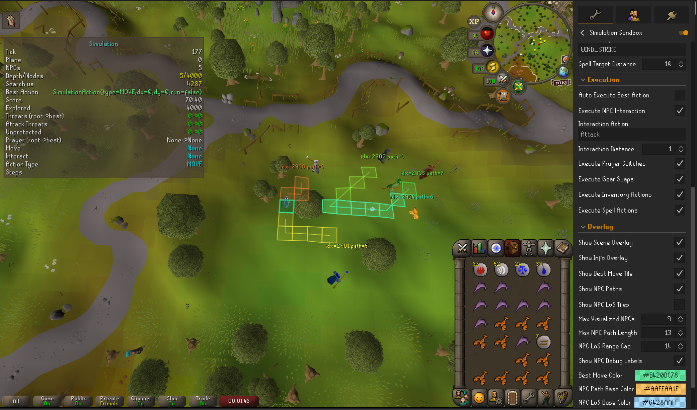

# Simulation Engine

The API provides two simulation areas:

- `com.kraken.api.simulation`: generic, RuneLite-compatible simulation for decision-tree search and in-game action execution.
- `com.kraken.api.simulation.colosim`: Colosseum-focused simulator/visualizer tooling.

Use `com.kraken.api.simulation` when you need to evaluate many candidate actions every game tick and choose one executable result.



## Generalized Simulation Overview

The simulation classes work by taking a "snapshot" of the game which includes:

- Local collision maps
- NPC's positioning (with configurable range, attack style, and attack speed)
- Player positioning
- game client information (like current tick etc...)

The simulation then runs a decision tree search over some configurable actions you potentially want to take like:
- Movement
- Attacking mobs
- Switching prayers
- Swapping gear
- eating food
- etc...

Developers provide scoring for various decisions in the decision tree search, 
and a valid in-game action is returned based on the scoring from the simulation for what to perform in-game.

The following lists some information about some of the simulation features and classes:

- NPC combat metadata in snapshots (style, range, speed, max-hit).
- Simulated player state (HP, active overhead prayer, inventory/equipment snapshots).
- Action types beyond movement:
  - prayer switching
  - equipment swaps
  - inventory interactions (including eat/heal)
  - spell casts
  - custom action markers
- Step-based executable outcomes in `SimulationDecisionAdapter`.
- A dedicated `SimulationActionPolicy` API to unify:
  - snapshot capture settings
  - candidate action generation
  - state scoring
  - adapter options
  - allowed executable step types

## Core Classes

- `SimulationSnapshotService`: captures immutable snapshots from live RuneLite state.
- `SimulationSnapshot`: immutable scene + player + npc snapshot.
- `SimulationPlayerSnapshot`: immutable player metadata in snapshot.
- `SimulationNpcSnapshot`: immutable npc metadata in snapshot.
- `SimulationState`: mutable branchable state (`copy()`).
- `SimulationEngine`: simulates ticks, movement, LoS, NPC attacks, prayer threats, and non-movement actions.
- `DecisionTreeSearch`: depth-limited search over candidate actions.
- `SimulationAction`: typed simulation action model.
- `SimulationDecisionAdapter`: converts the best simulation action into ordered executable steps and executes them.
- `SimulationActionPolicy`: dedicated policy for capture + generation + scoring + execution controls.

## Quick Start (Policy-Based)

```java
import com.kraken.api.simulation.*;

SimulationEngine engine = new SimulationEngine();

SimulationActionPolicy policy = SimulationActionPolicy.builder()
    .captureOptions(new SimulationSnapshotService.CaptureOptions()
        .withNpcRadius(24))
    .addActionProvider(ctx -> SimulationAction.standardWalkActions())
    .addScoringRule(ctx -> {
        int losThreats = ctx.getEngine().countNpcsWithLineOfSightToPlayer(ctx.getState());
        return -losThreats * 25.0;
    })
    .build();

SimulationSnapshot snapshot = SimulationSnapshotService.capture(policy.getCaptureOptions());
SimulationState root = snapshot.createState();

DecisionTreeSearch search = new DecisionTreeSearch(engine, 4000);
DecisionTreeSearch.Result result = search.search(
    root,
    2,
    policy.toActionGenerator(engine),
    policy.toStateEvaluator(engine)
);
```

## SimulationAction Types

The decision tree can return any of these:

- `SimulationAction.move(dx, dy)` / `SimulationAction.run(dx, dy)`
- `SimulationAction.switchPrayer(Prayer.PROTECT_FROM_MAGIC)`
- `SimulationAction.equipItem(itemId)`
- `SimulationAction.inventoryInteract(itemId, "Drink")`
- `SimulationAction.eat(itemId, healAmount)`
- `SimulationAction.castSpell(spell)`
- `SimulationAction.castSpellOnNpc(spell, npcIndex)`
- `SimulationAction.custom("my-action-id")`

## Capture Options Examples

### 1) Default Capture

```java
SimulationSnapshot snapshot = SimulationSnapshotService.capture();
```

### 2) Capture With Radius

```java
SimulationSnapshot snapshot = SimulationSnapshotService.capture(20);
```

### 3) Capture With NPC Combat Overrides

```java
Map<Integer, SimulationSnapshotService.NpcMetadata> npcOverrides = Map.of(
    415,  new SimulationSnapshotService.NpcMetadata(1, 4, NpcAttackStyle.MELEE, 30, true, false),
    3129, new SimulationSnapshotService.NpcMetadata(10, 4, NpcAttackStyle.MAGIC, 20, true, true),
    3130, new SimulationSnapshotService.NpcMetadata(10, 4, NpcAttackStyle.RANGED, 22, true, true)
);

SimulationSnapshotService.CaptureOptions options = new SimulationSnapshotService.CaptureOptions()
    .withNpcRadius(30)
    .withNpcMetadataProvider((npc, composition) -> npcOverrides.get(npc.getId()));

SimulationSnapshot snapshot = SimulationSnapshotService.capture(options);
```

### 4) Capture With Food-Heal Mapping

```java
Map<Integer, Integer> foodHealing = Map.of(
    385, 20,   // Shark
    3144, 18,  // Karambwan
    379, 12    // Lobster
);

SimulationSnapshotService.CaptureOptions options = new SimulationSnapshotService.CaptureOptions()
    .withNpcRadius(24)
    .withFoodHealingByItemId(foodHealing);
```

## Dedicated Action Policy

`SimulationActionPolicy` is the main extension point for plugin developers.

It lets you keep all combat logic in one object:

- action providers: what actions are legal candidates
- scoring rules: how states are ranked
- capture options: what metadata is captured
- adapt options: optional runtime interaction targeting
- allowed step types: execution safety gates

### Policy Example: Movement-Only Escape

```java
SimulationActionPolicy movementOnly = SimulationActionPolicy.builder()
    .captureOptions(new SimulationSnapshotService.CaptureOptions().withNpcRadius(20))
    .addActionProvider(ctx -> SimulationAction.standardWalkActions())
    .addScoringRule(ctx -> {
        SimulationEngine engine = ctx.getEngine();
        SimulationState state = ctx.getState();
        int threats = engine.countNpcsWithLineOfSightToPlayer(state);
        return -threats * 30.0;
    })
    .allowedExecutionSteps(Set.of(SimulationDecisionAdapter.ExecutableStepType.MOVE))
    .build();
```

### Policy Example: Prayer-Aware Defensive Policy

```java
SimulationActionPolicy prayerAware = SimulationActionPolicy.builder()
    .captureOptions(captureOptionsWithNpcMetadata)
    .addActionProvider(ctx -> {
        LinkedHashSet<SimulationAction> actions = new LinkedHashSet<>(SimulationAction.standardWalkActions());
        Prayer recommended = ctx.getEngine().recommendProtectionPrayer(ctx.getState());
        if (recommended != null && recommended != ctx.getState().getActiveProtectionPrayer()) {
            actions.add(SimulationAction.switchPrayer(recommended));
        }
        return new ArrayList<>(actions);
    })
    .addScoringRule(ctx -> {
        SimulationEngine engine = ctx.getEngine();
        SimulationState state = ctx.getState();
        int unprotected = engine.countUnprotectedNpcThreats(state);
        return -unprotected * 40.0;
    })
    .addScoringRule(ctx -> {
        Prayer recommended = ctx.getEngine().recommendProtectionPrayer(ctx.getState());
        return (recommended != null && recommended == ctx.getState().getActiveProtectionPrayer()) ? 20.0 : 0.0;
    })
    .build();
```

### Policy Example: Eat + Gear Swap + Spell Cast

```java
int gearItemId = 12924; // Toxic blowpipe, example
CastableSpell spell = Standard.WIND_STRIKE;

SimulationActionPolicy hybrid = SimulationActionPolicy.builder()
    .captureOptions(new SimulationSnapshotService.CaptureOptions()
        .withNpcRadius(24)
        .withFoodHealingByItemId(Map.of(385, 20, 3144, 18)))
    .addActionProvider(ctx -> {
        SimulationState state = ctx.getState();
        LinkedHashSet<SimulationAction> actions = new LinkedHashSet<>(SimulationAction.standardWalkActions());

        // Eat action
        if (state.getPlayerHitpoints() <= 40) {
            int heal = state.getFoodHealAmount(385);
            if (heal > 0 && state.hasInventoryItem(385)) {
                actions.add(SimulationAction.eat(385, heal));
            }
        }

        // Gear swap action
        if (state.hasInventoryItem(gearItemId) && !state.isItemEquipped(gearItemId)) {
            actions.add(SimulationAction.equipItem(gearItemId));
        }

        // Spell action
        int nearestNpcIndex = -1;
        int nearest = Integer.MAX_VALUE;
        for (int slot = 0; slot < state.getNpcCount(); slot++) {
            if (!state.isNpcActive(slot)) continue;
            int dx = Math.abs(state.getNpcX(slot) - state.getPlayerX());
            int dy = Math.abs(state.getNpcY(slot) - state.getPlayerY());
            int dist = Math.max(dx, dy);
            if (dist < nearest) {
                nearest = dist;
                nearestNpcIndex = state.getNpcIndex(slot);
            }
        }
        if (nearestNpcIndex >= 0) {
            actions.add(SimulationAction.castSpellOnNpc(spell, nearestNpcIndex));
        } else {
            actions.add(SimulationAction.castSpell(spell));
        }

        return new ArrayList<>(actions);
    })
    .addScoringRule(ctx -> ctx.getState().getPlayerHitpoints() * 1.2)
    .addScoringRule(ctx -> -ctx.getEngine().countUnprotectedNpcThreats(ctx.getState()) * 45.0)
    .allowedExecutionSteps(Set.of(
        SimulationDecisionAdapter.ExecutableStepType.MOVE,
        SimulationDecisionAdapter.ExecutableStepType.SWITCH_PRAYER,
        SimulationDecisionAdapter.ExecutableStepType.EQUIP_ITEM,
        SimulationDecisionAdapter.ExecutableStepType.INVENTORY_INTERACT,
        SimulationDecisionAdapter.ExecutableStepType.CAST_SPELL
    ))
    .build();
```

### Policy Example: Multi-Rule Scoring Composition

```java
SimulationActionPolicy composed = SimulationActionPolicy.builder()
    .addActionProvider(ctx -> SimulationAction.standardWalkActions())
    .addScoringRule(ctx -> {
        int los = ctx.getEngine().countNpcsWithLineOfSightToPlayer(ctx.getState());
        return -los * 20.0;
    })
    .addScoringRule(ctx -> {
        int attackThreats = ctx.getEngine().countNpcsAbleToAttackPlayer(ctx.getState());
        return -attackThreats * 25.0;
    })
    .addScoringRule(ctx -> {
        SimulationState s = ctx.getState();
        int nearest = Integer.MAX_VALUE;
        for (int i = 0; i < s.getNpcCount(); i++) {
            if (!s.isNpcActive(i)) continue;
            int dx = Math.abs(s.getNpcX(i) - s.getPlayerX());
            int dy = Math.abs(s.getNpcY(i) - s.getPlayerY());
            nearest = Math.min(nearest, Math.max(dx, dy));
        }
        return nearest == Integer.MAX_VALUE ? 0.0 : Math.min(nearest, 12) * 2.0;
    })
    .build();
```

## Adapter and Executable Steps

`SimulationDecisionAdapter` now emits ordered steps, not just movement.

Possible step types:

- `MOVE`
- `NPC_INTERACT`
- `SWITCH_PRAYER`
- `EQUIP_ITEM`
- `INVENTORY_INTERACT`
- `CAST_SPELL`

### Adapt and Execute

```java
SimulationDecisionAdapter.ExecutableAction executable = decisionAdapter.adapt(
    result,
    rootState,
    policy.getAdaptOptions()
);

// Execute only allowed step types from your policy
decisionAdapter.execute(executable, policy.getAllowedExecutionSteps());
```

### Adapt Options Example

```java
SimulationDecisionAdapter.AdaptOptions adaptOptions =
    new SimulationDecisionAdapter.AdaptOptions(
        "Attack", // optional NPC interaction action
        1,        // interaction distance
        10        // spell target distance fallback
    );
```

## End-to-End Loop Example

```java
SimulationEngine engine = new SimulationEngine();
DecisionTreeSearch search = new DecisionTreeSearch(engine, 5000);

SimulationActionPolicy policy = buildMyPolicy(); // your policy builder method

SimulationSnapshot snapshot = SimulationSnapshotService.capture(policy.getCaptureOptions());
SimulationState root = snapshot.createState();

DecisionTreeSearch.Result result = search.search(
    root,
    2,
    policy.toActionGenerator(engine),
    policy.toStateEvaluator(engine)
);

SimulationDecisionAdapter.ExecutableAction executable = decisionAdapter.adapt(
    result,
    root,
    policy.getAdaptOptions()
);

decisionAdapter.execute(executable, policy.getAllowedExecutionSteps());
```

## Performance Tips

- Keep depth low (`1-3`) and node cap bounded.
- Restrict the snapshot radius to a local encounter scope.
- Keep action provider sets focused to avoid action explosion.
- Prefer adding multiple small scoring rules instead of one giant scorer.
- Use allowed execution step filtering when testing risky policies.

## Colosseum Simulator Note

`com.kraken.api.simulation.colosim` remains a useful domain-specific reference for Colosseum behavior and timeline tooling.

For generic RuneLite plugin combat/action simulation, use `com.kraken.api.simulation`.
