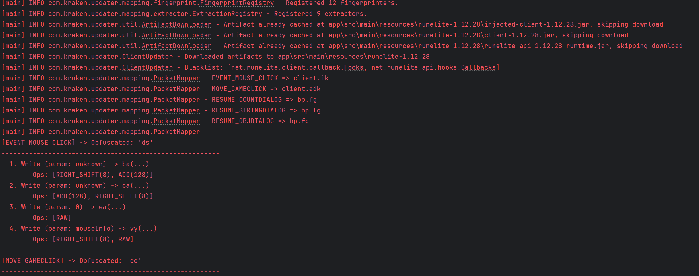
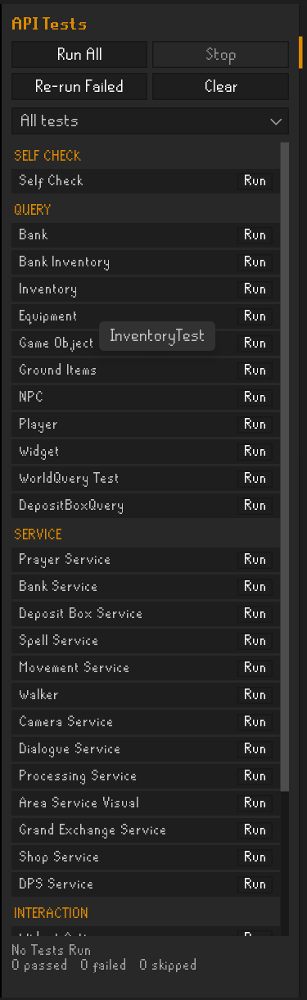

# Game Updates

The following documentation details how to update the Kraken API in response to game updates and new client revisions.
Game updates can be broken down into two main categories (with relation to this API):

- RuneLite updates (~weekly)
- Client Revision updates (~bi-monthly)
  - Packet Updates
  - Reflection Updates

---

## RuneLite Updates

RuneLite updates are often simple as the RuneLite API doesn't generally drastically change from release
to release. To test the API against the latest RuneLite version:

- Update `def runeLiteVersion = 'x.y.z'` in `build.gradle` to the latest RuneLite version
- Compile the API against the newest version with `./gradlew clean build`
- Some RuneLite specific changes in the hooks.json file may need to be updated like: logging fields, call stack methods, etc...
- Verify that there are no compile time errors.

If there are compile time errors, then the RuneLite API changed, and you will have to dig a little deeper
into what changed, where it went, and how to restore functionality in the API. Luckily, this doesn't happen
all that often despite weekly RuneLite updates.

Detailed instructions for manually mapping each field can [be found here](https://kraken-plugins.com/docs/client-development/mapping/manual-mapping.html) although,
for RuneLite updates, the fields that normally change are all under `securityHooks`:

- `securityHooks.clientLogFieldName`
- `securityHooks.cleanCallStackValue`

> :warning: **Note:** Care should still be taken in updating the RuneLite version as new detection methods for third party clients and plugins
> can be added at any point in time (even for minor patch versions).

## Client Revision Updates

Client revision updates are generally more work. The gamepack JAR file will be re-obfuscated, and new mappings
will need to be generated to call/update the right classes, fields, and methods in the client that RuneLite
does not directly expose.

Luckily, client revision updates are less common and generally occur bi-monthly or quarterly. The Kraken API uses a
`hooks.json` file as its source of truth for packet mappings, reflection hooks, and client patches. This is the **only**
file that needs updated after a revision update and is located in `./src/main/resources/hooks.json`. The [Kraken Updater
CLI tool](https://github.com/Kraken-Plugins/kraken-updater) is specifically developed to analyze the newest game client (`injected-client.jar`)
and automatically remap the necessary fields and packets in the exact format which this API expects.

More documentation can be found in the readme of the updater, but in short point the tool at the new version of RuneLite,
and it will download the client jars and generate `mappings-<version>.json`:

```shell
./gradlew :app:run --args="--version 1.12.38 --output build/output"
```

Useful flags:

- `--version` / `-v` (required): the RuneLite client version to analyze
- `--output` / `-o`: directory for the generated `mappings-<version>.json` (default `app/src/main/resources`)
- `--input-dir` / `-i`: where the downloaded client jars are cached
- `--diff` / `-d`: fetch the currently deployed `hooks.json` and log every field that changed, filling in any packet write the run could not resolve from the deployed copy



### Missing Maps

The injected-client changes from revision to revision, so it is quite possible that the automated mapper may miss, omit, or
get some mappings wrong. It is **CRITICAL** that each mapping is double-checked for accuracy. We recommend using a tool
like [JStudio](https://github.com/Tonic-Box/JStudio/) to open and decompile the `injected-client.jar` file to manually
check the mappings.

There is existing [documentation here](https://kraken-plugins.com/docs/client-development/mapping/manual-mapping.html) on how to manually find and map each field in the `hooks.json` file.
If you are unfamiliar with mapping obfuscated code, then [this guide](https://kraken-plugins.com/docs/client-development/mapping/mapping.html) will help to get you familiar with specific structures you are looking for
in the client. The mapping guide will include helpful pointers for mapping tricky packets write ordering, finding the `doAction` method, and discovering key packet sending reflection hooks.

### Packet preflight invariants

`PacketClient` validates and serializes the payload before calling the mapped node factory. That factory consumes
ISAAC when it writes the opcode, so no malformed payload or missing enqueue handle may reach it.

Alongside the existing hooks, maintain `reflectionHooks.clientPacketLengthField` and
`reflectionHooks.clientPacketLengthMultiplier`. For the pinned injected client `1.12.38`, the decoded length is
`js.eo * -1758762607` (Java int overflow is intentional). This multiplier follows the factory's
`-1950310809 * -1669214905` multiplication chain. If updater output omits these fields, derive and add them from
the new client before using that output; missing metadata rejects sends before cipher consumption.

Re-vet these contracts from the actual injected-client bytecode on every revision:

- The mapped factory name/signature (`ef.af(js, yt, byte)` in `1.12.38`) writes exactly one encrypted opcode before returning.
- Packet lengths `-1` and `-2` select capacities 260 and 10000. Fixed lengths up to 18 select 20;
  up to 98 select 100; larger fixed packets select 260. Capacity includes the opcode.
- Variable-length payloads include their one- or two-byte length prefix; that prefix excludes itself and includes string terminators.
- Offset/index multipliers remain modular inverses, and the buffer exposes writable instance offset and byte-array fields.
- Enqueue supports the verified instance `(node, garbage)` or static `(writer, node[, garbage])` signature.

Run `./gradlew test`. `PacketPayloadTest` pins the six bundled packet byte layouts; `PacketPreflightTest` verifies
zero factory/cipher use on invalid inputs and failure after allocation; `PinnedPacketAbiTest` checks live packet constants
and factory capacities using a fresh private cipher with no client session or network connection.
`ClientThreadGatewayTest` covers deadline, interruption, shutdown cancellation, and unknown outcomes once execution starts.
These offline checks do not replace the in-client smoke tests below.

## Finishing the Update

Once the mappings have been generated by the Kraken updater and validated for correctness, they can be tested within the API.
Copy the `mappings-<version>.json` file generated by the updater to `./src/main/resources/hooks.json`. Launch the API tests plugin with
`./gradlew runelite`, or by running the `PluginRunnerTest.java` main class in the `src/test/java` directory with the arguments
`plugins.api.ApiTestPlugin --developer-mode` and the VM args `-ea`. This will launch the client
using the latest hooks file with a plugin that can quickly execute core API functionalities to test that the new hooks work. Start with the
`SelfCheckTest` entry in the API Tests panel, which exercises every hook.

More documentation on this plugin and its requirements can be [read here](https://github.com/Kraken-Plugins/kraken-api/blob/master/docs/TESTS.md).


